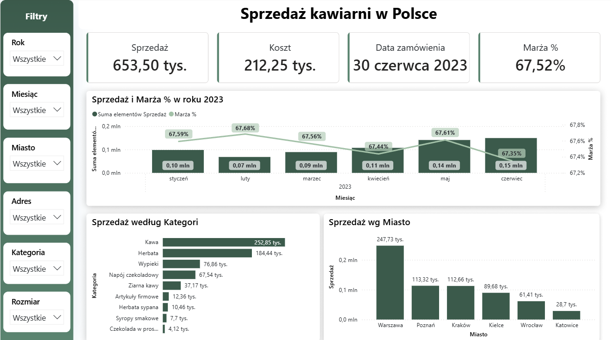
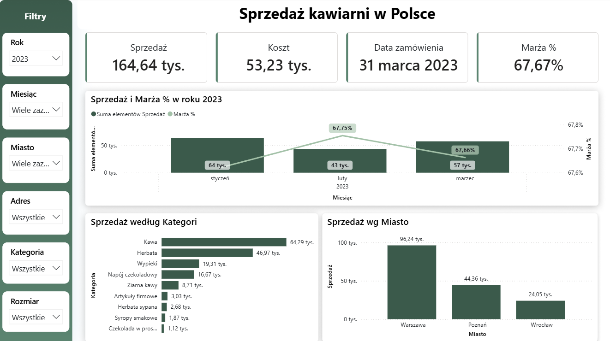

# powerbi-coffee-sales-dashboard
# ☕ Dashboard sprzedaży kawiarni w Polsce

Interaktywny dashboard stworzony w **Power BI** do analizy sprzedaży sieci kawiarni w Polsce.

## 📊 Podgląd dashboardu

---

# 📌 Opis projektu

Projekt przedstawia interaktywny dashboard umożliwiający analizę sprzedaży kawiarni w Polsce.

Raport pozwala monitorować najważniejsze wskaźniki biznesowe oraz analizować sprzedaż z różnych perspektyw, takich jak czas, lokalizacja oraz kategorie produktów.

Dashboard został przygotowany z wykorzystaniem modelu danych Power BI, transformacji danych w Power Query oraz miar DAX.

---

# Funkcjonalności

- Interaktywne filtry:
  - Rok
  - Miesiąc
  - Miasto
  - Adres
  - Kategoria
  - Rozmiar

- Karty KPI prezentujące:
  - Sprzedaż
  - Koszt
  - Marżę
  - Datę zamówienia

- Analiza sprzedaży w czasie

- Analiza marży

- Sprzedaż według kategorii produktów

- Sprzedaż według miasta

- Dynamiczne filtrowanie wszystkich wizualizacji

---

# 🛠 Wykorzystane technologie

- Power BI Desktop
- Power Query
- DAX
- Microsoft Excel
- CSV

---

# 📂 Struktura repozytorium

Coffee-Sales-Dashboard.pbix

data/
├── Produkty.xlsx
├── Sklepy.csv
└── Sprzedaz/
    ├── 202301.csv
    ├── 202302.csv
    ├── 202303.csv
    ├── 202304.csv
    ├── 202305.csv
    └── 202306.csv

screenshots/
├── dashboard-overview.png
└── sales-by-city.png

README.md

---

# 📷 Dodatkowy zrzut ekranu

---

# 📁 Zawartość projektu

| Plik | Opis |
|------|------|
| Coffee-Sales-Dashboard.pbix | Główny raport Power BI |
| data/ | Dane źródłowe wykorzystane w projekcie |
| screenshots/ | Zrzuty ekranu dashboardu |
| README.md | Opis projektu |

---

# 🎯 Cel biznesowy

Celem projektu było stworzenie dashboardu umożliwiającego szybkie monitorowanie sprzedaży oraz marży w sieci kawiarni.

Raport pozwala identyfikować:

- najlepiej sprzedające się produkty,
- miasta generujące najwyższą sprzedaż,
- zmiany sprzedaży w czasie,
- poziom marży,
- wpływ filtrów na analizowane dane.

Dashboard może stanowić wsparcie dla kadry zarządzającej podczas podejmowania decyzji biznesowych.

---

## 📁 Files

- Coffee-Sales-Dashboard.pbix – Power BI report
- data/ – source data
- screenshots/ – dashboard previews

---

# 📈 Stworzenie projektu obejmowało:

- Modelowanie danych
- Tworzenie relacji między tabelami
- Transformacja danych w Power Query
- Tworzenie miar DAX
- Projektowanie dashboardów
- Wizualizacja danych
- Analiza KPI
- Projektowanie interaktywnych raportów
